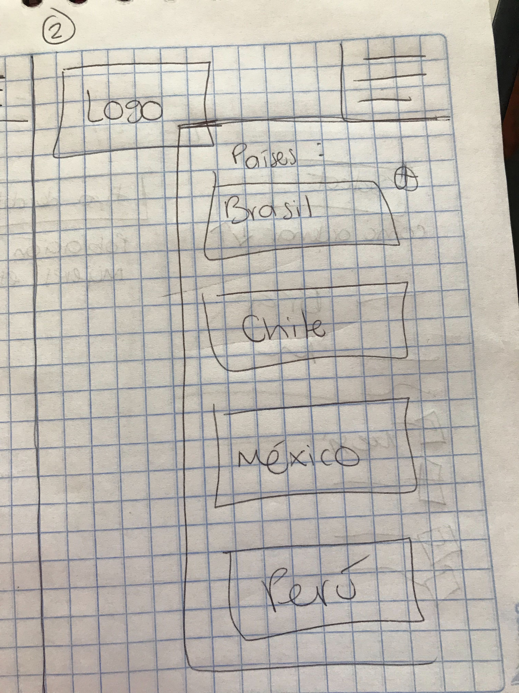
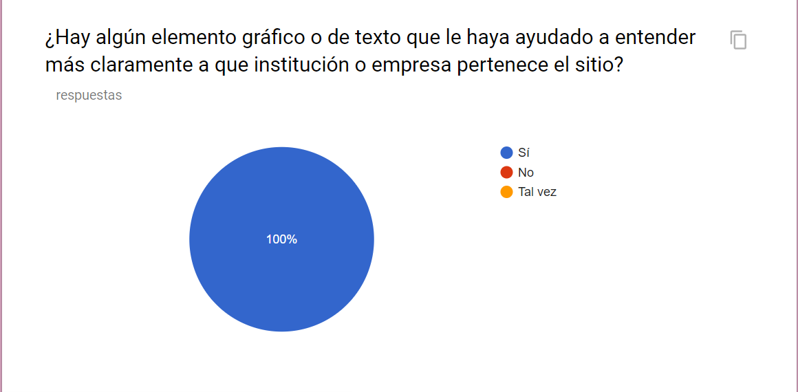

# ProMujer

## Índice

- [Preámbulo](#preámbulo)
- [Descripción](#resumen-del-proyecto)
- [Consideraciones generales](#consideraciones-generales)
- [Consideraciones técnicas](#consideraciones-técnicas)
- [Primeros pasos](#primeros-pasos)
- [Contenido de referencia](#contenido-de-referencia)
- [Checklist](#checklist)


## Preámbulo

Cada año, 12 millones de niñas se casan antes de los 18 años. A nivel mundial, 1 de cada 5 niñas es madre antes de cumplir dicha edad.

Todas los niñas merecen alcanzar su máximo potencial, pero la desigualdad de género que permea su vida y la de sus cuidadores impide que esto sea realidad.

La desigualdad de género está presente en el día a día de niñas y niños, tanto en sus hogares como en sus comunidades, en los libros de texto, los medios de comunicación y entre los hombres y mujeres que cuidan de ellos.

De la misma manera, la distribución desigual de los quehaceres domésticos socializa a los niños y les hace creer que la única función de las mujeres es hacerse cargo del hogar, lo cual limita el cambio generacional y reduce las ambiciones de las niñas.

Los niños y niñas que son testigos de violencia de género en sus hogares tienen una mayor tendencia a imitar estas dinámicas violentas en sus relaciones adultas, ya sea como autores o víctimas.

Sin embargo, durante la primera infancia, la disparidad entre niños y niñas es relativamente limitada. La tasa de supervivencia al nacer es más elevada entre las niñas, y sus probabilidades de presentar un desarrollo adecuado y de asistir a la escuela preescolar son, respectivamente, mayores e iguales a las de los niños.

Aun así, conforme crecen, las barreras de género se acentúan.

Factores tales como las tareas domésticas, cuidar de los hermanos o los problemas de seguridad, impiden que las niñas vayan a la escuela, mientras que la deserción escolar de los niños se debe a que se espera que estos ganen dinero. Al llegar a los 10 años, el mundo de los niños a menudo se expande, mientras que el de las niñas se contrae, lo cual acarrea consecuencias negativas que pueden durar toda la vida.

## Resumen del proyecto


### Definición del producto

El desarrollo de esta aplicación web tiene como objetivo servir de apoyo a las organizaciones no lucrativas (y a los profesionales y voluntarios que trabajan o colaboran con ellas), interesadas en impulsar el desarrollo de la mujer a través de la educación. 

La mayoría de estas entidades no lucrativas carecen de la necesaria capacitación que les permita realizar su trabajo de una manera profesional y eficiente.

Esas carencias formativas son el objetivo principal de nuestra organización.

ProMujer es un Centro de investigación para el Desarrollo de la mujer en América Latina que cuenta con programas de investigación y desarrollo, publicación de contenidos, etc.

Aprovecha su presencia mundial y las alianzas con sus asociados para fomentar la igualdad de género. El Plan de Acción para la Igualdad entre los Géneros es la guía para hacer que las reglas del juego sean más justas.

### Historias de usuario

Al realizar las historias de nuestros usuarios, encontramos que las mas recurrentes fueron:

- Usuario 1: Necesito ver un menú con los países de América Latina y sus niveles en educación.

- Usuario 2: Quiero acceder rápidamente a los indicadores según el país de mi interés.


### Diseño de la Interfaz de Usuario

Con el objetivo de facilitar a los usuarios la navegación por nuestra web app, diseñamos una interfaz gráfica con un look & feel simple y concreto, por medio de los siguientes elementos:

- Identificación: Agregamos un nombre a la web (ProMujer), logo, banner en el main, frase corta con el tema principal.

- Navegación: Agregamos el Menú principal, elemento de regreso a la home, información sobre la ubicación del usuario dentro del sitio web, títulos y textos en un lenguaje claro y conciso, presentados en un formato agradable y de fácil lectura

- Interacción: Para provocar la interacción del usuario, ofrecemos la posibilidad de realizar acciones específicas, para que elija el contenido de su interés.

- Paleta de color: 
    Amarrillo, para elementos de mayor jerarquía. 
    Gris, para textos y elementos de poco peso visual.
    Blanco, para hacer pausas a través de espacios vacíos (background). 
    
- Tipografía: Roboto sans-serif para darle un aspecto fresco, simple y legible a la página web.

- Plecas: Se utilizaron para dividir visualmente cada sección de la página.  

- Banner: Uso de banner como elemento princial, que reafirme al usiario el contenido de esta web app.

#### Prototipo de baja fidelidad
Para iniciar nuestro diseño partimos desde un dispositivo mobile. Nuestros primeros sketch son los siguientes:





#### Prototipo de alta fidelidad
El prototipo de alta fidelidad sufrió cambios a lo largo de las iteraciones del producto, con base a los resultados obtenidos en las encuestas.


#### Testeos de usabilidad
Se realizaron encuestas principalmente a profesionales y voluntarios que trabajan en asociaciones no lucrativas. Con el objetivo de conocer su principal impresión del producto.




### Pruebas unitarias

El _boilerplate_ de este proyecto no incluye pruebas unitarias, pero esperamos
que escribas tus propias pruebas unitarias para las funciones encargadas de
_procesar_, _filtrar_ y _ordenar_ la data, así como _calcular_ estadísticas.
Para ello te recomendamos implementar las siguientes funciones en el archivo
`src/data.js`:

- `filterData(data, condition)`: esta función `filter` o filtrar recibiría la
  data, y nos retornaría aquellos datos que sí cumplan con la condición.

- `sortData(data, sortBy, sortOrder)`: esta función `sort` u ordenar
  recibe tres parámetros.
  El primer parámetro, `data`, nos entrega los datos.
  El segundo parámetro, `sortBy`, nos dice con respecto a cuál de los campos de
  la data se quiere ordenar.
  El tercer parámetro, `sortOrder`, indica si se quiere ordenar de manera
  ascendente o descendente.

- `computeStats(data)`: la función `compute` o calcular, nos permitirá hacer
  cálculos estadísticos básicos para ser mostrados de acuerdo a la data
  proporcionada.

Estas son propuestas de funciones que podrías implementar.

El archivo `src/data.js` debe tener una cobertura del 70% de _statements_
(_sentencias_), _functions_ (_funciones_), _lines_ (_líneas_), y _branches_
(_ramas_).

**Estas funciones deben ser [_puras_](https://medium.com/laboratoria-developers/introducci%C3%B3n-a-la-programaci%C3%B3n-funcional-en-javascript-parte-2-funciones-puras-b99e08c2895d)
e independientes del DOM**. Estas funciones serán después usadas desde el archivo
`src/main.js`, al cargar la página, y cada vez que el usuario interactúe (click,
filtrado, ordenado, ...).

## Consideraciones técnicas

La lógica del proyecto está implementada completamente en JavaScript
(ES6), HTML y CSS. 

Se implementaron pruebas unitarias para validar las funciones encargadas de procesar, filtrar y ordenar la data. Estos test se realizaron con [Jest](https://jestjs.io/).

Como gestor de proyecto de utilizó NPM (Node Package Manager).

El _boilerplate_ contiene una estructura de archivos como punto de partida así
como toda la configuración de dependencias:

```text
.
├── package.json
├── README.md
├── src
│   ├── data
│   │   ├── injuries
│   │   │   ├── injuries.js
│   │   │   └── injuries.json
│   │   ├── lol
│   │   │   ├── lol.js
│   │   │   └── lol.json
│   │   ├── pokemon
│   │   │   ├── pokemon.js
│   │   │   └── pokemon.json
│   │   ├── steam
│   │   │   ├── steam.js
│   │   │   └── steam.json
│   │   └── worldbank
│   │       ├── worldbank.js
│   │       └── worldbank.json
│   ├── data.js
│   ├── index.html
│   ├── main.js
│   └── style.css
└── test
    └── data.spec.js

8 directories, 17 files
```

## Pistas sobre cómo empezar a trabajar en el proyecto

Para empezar se sugiere:
1. Realizar un :fork_and_knife:
   [fork](https://help.github.com/articles/fork-a-repo/) del repo.
2. :arrow_down: [Clona](https://help.github.com/articles/cloning-a-repository/)
   tu :fork_and_knife: a tu computadora (copia local).
3. 📦 Instalar las dependencias del proyecto con el comando `npm install`. Esto
   asume que has instalado [Node.js](https://nodejs.org/) (que incluye [npm](https://docs.npmjs.com/)).
4. Si todo ha ido bien, deberías poder ejecutar las :traffic_light:
   pruebas unitarias (unit tests) con el comando `npm test`.
5. A codear se ha dicho! :rocket:


## Contenido de referencia

### Diseño de experiencia de usuario (User Experience Design)

- Investigación con usuarios / entrevistas
- Principios de diseño visual

### Desarrollo Front-end

- Unidad de testing en curso de JavaScript en LMS.
- Unidad de arreglos en curso de JavaScript en LMS.
- Unidad de objetos en curso de JavaScript en LMS.
- Unidad de funciones en curso de JavaScript en LMS.
- Unidad de DOM en curso de Browser JavaScript en LMS.
- [Array en MDN](https://developer.mozilla.org/es/docs/Web/JavaScript/Referencia/Objetos_globales/Array)
- [Array.sort en MDN](https://developer.mozilla.org/es/docs/Web/JavaScript/Referencia/Objetos_globales/Array/sort)
- [Array.map en MDN](https://developer.mozilla.org/es/docs/Web/JavaScript/Referencia/Objetos_globales/Array/map)
- [Array.filter en MDN](https://developer.mozilla.org/es/docs/Web/JavaScript/Referencia/Objetos_globales/Array/filter)
- [Array.reduce en MDN](https://developer.mozilla.org/es/docs/Web/JavaScript/Referencia/Objetos_globales/Array/reduce)
- [Array.forEach en MDN](https://developer.mozilla.org/es/docs/Web/JavaScript/Referencia/Objetos_globales/Array/forEach)
- [Object.keys en MDN](https://developer.mozilla.org/es/docs/Web/JavaScript/Referencia/Objetos_globales/Object/keys)
- [Object.entries en MDN](https://developer.mozilla.org/es/docs/Web/JavaScript/Referencia/Objetos_globales/Object/entries)
- [Fetch API en MDN](https://developer.mozilla.org/en-US/docs/Web/API/Fetch_API)
- [json.org](https://json.org/json-es.html)

### Herramientas

- [Git](https://git-scm.com/)
- [GitHub](https://github.com/)
- [GitHub Pages](https://pages.github.com/)
- [Node.js](https://nodejs.org/)
- [Jest](https://jestjs.io/)

---

## Checklist

- [ ] Usa VanillaJS.
- [ ] No hace uso de `this`.
- [ ] Pasa linter (`npm pretest`)
- [ ] Pasa tests (`npm test`)
- [ ] Pruebas unitarias cubren un mínimo del 70% de statements, functions y
      lines y branches.
- [ ] Incluye _Definición del producto_ clara e informativa en `README.md`.
- [ ] Incluye historias de usuario en `README.md`.
- [ ] Incluye _sketch_ de la solución (prototipo de baja fidelidad) en
      `README.md`.
- [ ] Incluye _Diseño de la Interfaz de Usuario_ (prototipo de alta fidelidad)
      en `README.md`.
- [ ] Incluye el listado de problemas que detectaste a través de tests de
      usabilidad en el `README.md`.
- [ ] UI: Muestra lista y/o tabla con datos y/o indicadores.
- [ ] UI: Permite ordenar data por uno o más campos (asc y desc).
- [ ] UI: Permite filtrar data en base a una condición.

## Checklist (Opcional)

- [ ] Consume data de forma dinámica (`fetch()`).
- [ ] Utiliza Librerías de graficas (`chart.js` ó `google chart`).
- [ ] Cobertura de coverage al 100%.


